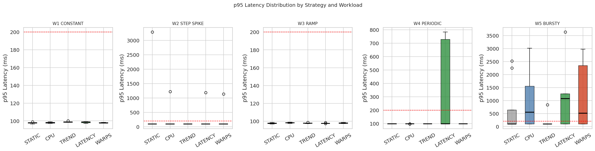
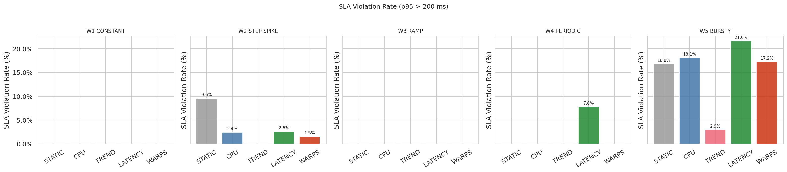
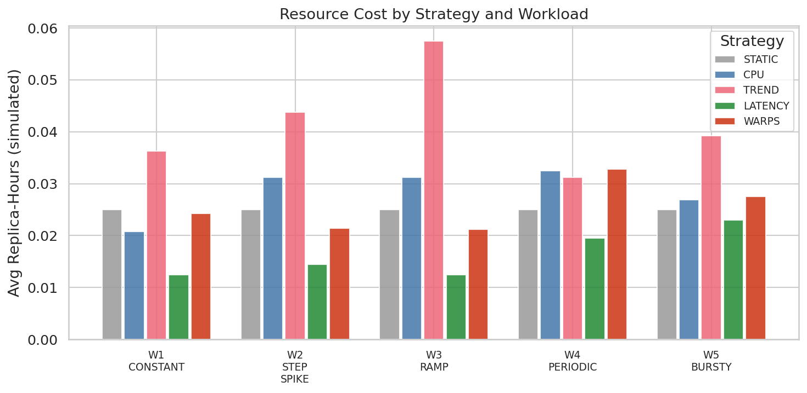
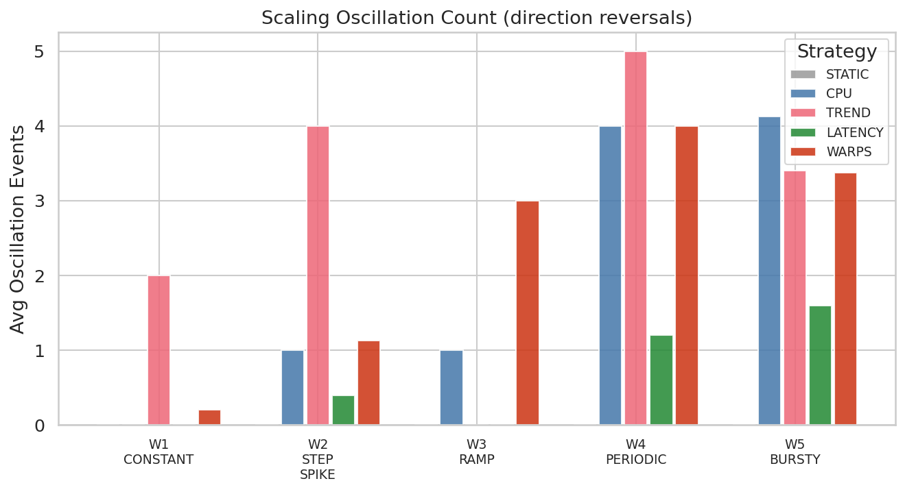
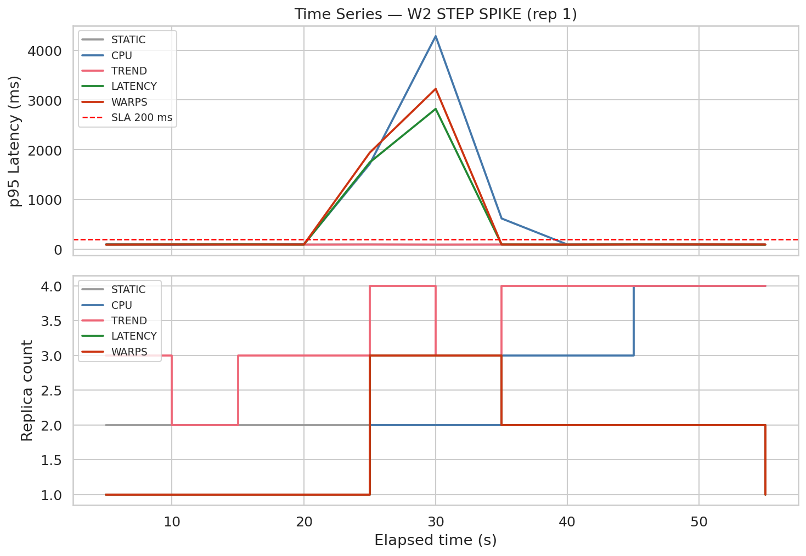
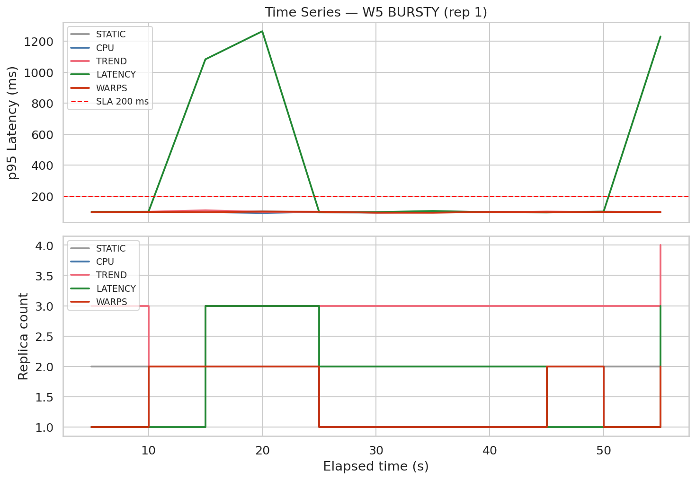
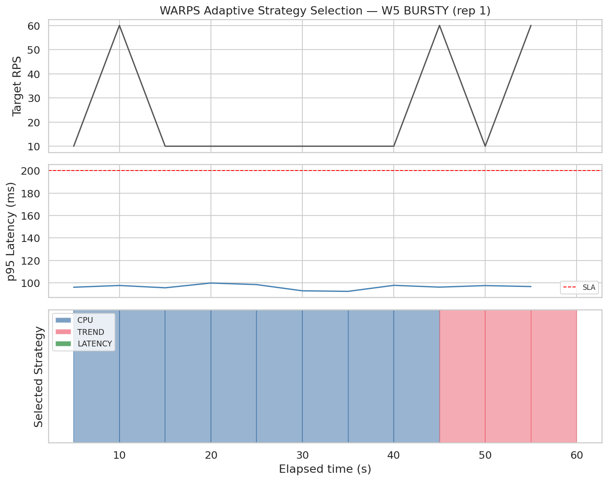
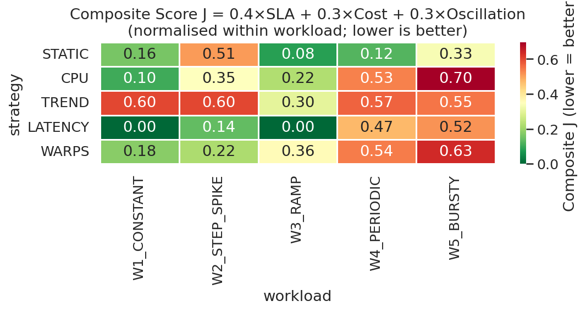

# Cloud Resource Scaling — Evaluation Platform

## What problem are we solving?

Imagine you're running a web app on the cloud. Sometimes traffic is low, sometimes it suddenly spikes (sale day, viral post, whatever). You can't keep 100 servers running all the time — that's expensive. You also can't run on 2 servers and hope for the best — users will get slow responses or errors.

**Auto-scaling** solves this: the system watches metrics (CPU, latency, etc.) and automatically adds/removes replicas.

But here's the catch — **which metric should you scale on?** CPU? Latency? Something else? And what if traffic pattern keeps changing?

That's what we're trying to figure out.

---

## What we built

A complete test platform (Python) with three main parts:

1. **Target service** — a fake HTTP server (`target_app/`) that behaves like a real backend. It has limited capacity per replica, so when load is too high, requests queue up and latency goes up. Just like a real system.

2. **Scaling strategies** (`autoscaler/strategies/`) — different algorithms that decide when to scale up or down. We have 4 baselines + our proposed approach.

3. **Experiment runner** (`autoscaler/runner/`) — sends real HTTP traffic, runs scaling decisions every few seconds, records everything, and saves results as JSON.

We also have an analysis pipeline that generates graphs and stats tables automatically.

---

## The strategies we tested

| Strategy | How it works | Real-world equivalent |
|----------|-------------|----------------------|
| **STATIC** | Never scales. Fixed 2 replicas always. | No autoscaling at all |
| **CPU** | Scales when utilisation crosses a threshold (70% up, 30% down) | Kubernetes HPA on CPU |
| **TREND** | Looks at rate of change — scales *before* threshold is hit | Proactive / predictive scaling |
| **LATENCY** | Scales when p95 response time goes above 200ms | SLO-based scaling |
| **WARPS** *(ours)* | Watches traffic pattern and switches between CPU/TREND/LATENCY automatically | Adaptive meta-controller |

**WARPS** = Workload-Aware Reactive Policy Selector. The idea is simple — no single strategy is best for all traffic types, so why not pick the right one dynamically?

---

## The workloads we tested

We simulate 5 different traffic patterns to see how strategies behave:

| Workload | What it simulates | Example |
|----------|------------------|---------|
| **W1 Constant** | Steady background traffic | Normal day traffic |
| **W2 Step Spike** | Sudden jump from low to high | Flash sale going live |
| **W3 Ramp** | Gradual linear increase | App going viral slowly |
| **W4 Periodic** | Sinusoidal up and down | Daily peak hours pattern |
| **W5 Bursty** | Random heavy bursts | Unpredictable traffic spikes |

Each strategy × workload combination is run multiple times (5 reps) with different random seeds, so results are statistically meaningful.

---

## Project structure

```
cloud-resource-scaling/
├── target_app/
│   └── app.py                  # Fake HTTP service (Flask)
├── autoscaler/
│   ├── strategies/
│   │   ├── cpu.py              # CPU-based scaling
│   │   ├── trend.py            # Trend-based scaling
│   │   ├── latency.py          # Latency-based scaling
│   │   └── warps.py            # Our adaptive approach
│   ├── workloads/
│   │   └── generators.py       # W1–W5 traffic patterns
│   └── runner/
│       ├── experiment.py       # Single experiment runner
│       └── batch_runner.py     # Full matrix runner
├── analysis/
│   ├── stats.py                # Stats + Mann-Whitney tests
│   └── plots.py                # Figure generation
├── results/
│   ├── raw/                    # JSON results per run
│   ├── summary.csv             # Aggregated stats
│   └── statistical_tests.csv   # Significance tests
├── figures/                    # Generated plots (PNG)
├── paper/                      # LaTeX tables for report
├── tests/                      # Unit tests (33 tests)
├── run_experiments.py          # Run all experiments
├── analyze_results.py          # Generate figures + tables
└── requirements.txt
```

---

## Setup

You'll need Python 3.10+ (we used 3.12).

```bash
# Clone and enter the repo
git clone <repo-url>
cd cloud-resource-scaling

# Install dependencies
pip install -r requirements.txt
```

That's it. No Docker or Kubernetes needed for running experiments — everything runs locally.

---

## How to run

### Run experiments

```bash
# Quick run (~25 min) — 3 strategies, 3 workloads, 3 reps
python3 run_experiments.py --mode quick

# Full run (~2 hours) — all 5 strategies, 5 workloads, 5 reps
python3 run_experiments.py --mode full

# Custom — pick what you want
python3 run_experiments.py --strategies CPU WARPS --workloads W2_STEP_SPIKE W5_BURSTY --reps 3
```

Results get saved to `results/raw/` as JSON files.

### Generate analysis and figures

```bash
python3 analyze_results.py
```

This reads all results, prints summary tables, runs statistical tests, and saves 9 figures to `figures/`.

### Run unit tests

```bash
python3 -m pytest tests/ -v
```

Should show 33 passed.

---

## Experiment results (152 runs)

We ran the full matrix: **5 strategies × 5 workloads × 5 repetitions** (plus a smaller quick run earlier). Total 152 experiment runs. Below is what came out of it — numbers + figures with explanation.

### Quick numbers (p95 latency in ms, SLA violation %)

| Strategy | W1 Const | W2 Step | W3 Ramp | W4 Periodic | W5 Bursty |
|----------|----------|---------|---------|-------------|-----------|
| STATIC   | 97.8 / 0% | 496.9 / 9.6% | 97.6 / 0% | 98.0 / 0% | 670.2 / 16.8% |
| CPU      | 97.9 / 0% | 238.1 / 2.4% | 98.2 / 0% | 98.1 / 0% | 972.4 / 18.1% |
| TREND    | 99.0 / 0% | **98.0 / 0%** | 97.9 / 0% | 97.9 / 0% | **245.8 / 2.9%** |
| LATENCY  | 98.4 / 0% | 316.0 / 2.6% | 97.6 / 0% | 361.0 / **7.8%** | 1233.3 / **21.6%** |
| WARPS    | 97.8 / 0% | **227.6 / 1.5%** | 97.9 / 0% | 98.2 / 0% | 1139.5 / 17.2% |

Format: `p95 latency / SLA violation rate`. Lower is better for both.

---

### Figure 1 — p95 Latency distribution



**What this shows:** Box plots of response time (p95) for each strategy under each workload. Red dashed line = our 200ms SLA target.

**What we see:**
- **W1 Constant & W3 Ramp** — everyone is fine. All boxes sit around 100ms. Easy workloads, nothing interesting here.
- **W2 Step Spike** — STATIC goes crazy (outliers up to 3300ms). It never scales, so when traffic jumps, users suffer. TREND stays flat near 100ms because it scaled early. CPU, WARPS, LATENCY all get brief spikes before scaling kicks in.
- **W4 Periodic** — LATENCY is the clear loser here. Its box stretches up to 750ms. It keeps reacting to each wave of the sine pattern and gets it wrong every time.
- **W5 Bursty** — hardest workload. TREND handles it best (smallest box). LATENCY has the worst median (~1100ms). CPU and WARPS are in the middle.

**Takeaway:** No single fixed strategy wins everywhere. TREND is great on hard workloads but LATENCY collapses on periodic/bursty patterns.

---

### Figure 2 — SLA violation rate



**What this shows:** What % of requests took longer than 200ms. This is the user-facing metric — how often did we fail our promise?

**What we see:**
- **W1 & W3** — 0% for everyone. Steady/ramp traffic is not a problem for any strategy.
- **W2 Step Spike** — STATIC at 9.6%, CPU at 2.4%, WARPS at 1.5%, TREND at 0%. Clear ranking.
- **W4 Periodic** — only LATENCY fails (7.8%). Everyone else stays at 0%.
- **W5 Bursty** — TREND wins again at 2.9%. LATENCY is worst at 21.6% — worse than doing nothing (STATIC at 16.8%).

**Takeaway:** LATENCY strategy sounds good in theory ("scale when users are suffering") but in practice it reacts too late and too chaotically on dynamic workloads. TREND is the most reliable for SLA, but we'll see it pays for that in cost.

---

### Figure 3 — Resource cost (replica-hours)



**What this shows:** How much compute each strategy consumed (avg replica-hours). More replicas running for longer = more cost. This is a simulated cost, not real AWS billing, but good for comparison.

**What we see:**
- **TREND** is the most expensive on almost every workload. On W3 Ramp it uses nearly double what STATIC uses — it keeps scaling up proactively even when load is still manageable.
- **LATENCY** is the cheapest — but that's because it barely scales at all. Cheap and unreliable is not a good tradeoff.
- **WARPS** sits in the middle. Uses fewer replicas than TREND/CPU on most workloads while keeping SLA reasonable.
- **STATIC** is fixed cost everywhere (same bar height) — predictable but useless when load spikes.

**Takeaway:** TREND buys you SLA with money. LATENCY saves money by not scaling enough. WARPS tries to balance both.

---

### Figure 4 — Scaling oscillation



**What this shows:** How many times a strategy flipped direction — scaled up then immediately scaled down (or vice versa). High oscillation = unstable, wasteful, bad for production.

**What we see:**
- **STATIC** — always 0, obviously. It never moves.
- **TREND** — oscillates the most on W2 (4 events) and W4 (5 events). It over-reacts to load changes.
- **CPU & WARPS** — moderate oscillation on W4 and W5 (3–4 events). Expected for reactive strategies.
- **LATENCY** — lowest among dynamic strategies. But again, that's mostly because it barely scales.

**Takeaway:** Oscillation is a real problem in autoscaling. TREND's aggressiveness causes instability. WARPS doesn't eliminate it but doesn't make it worse than CPU either.

---

### Figure 5 — Time series: Step Spike (W2)



**What this shows:** What actually happened during one step-spike experiment, second by second. Top graph = latency, bottom graph = replica count.

**What we see:**
- Around **t=20s**, traffic jumps from 10 to 55 RPS. You can see the latency spike immediately after.
- **TREND (pink)** had already scaled to 3 replicas before the spike hit — proactive scaling working as intended.
- **CPU (blue)** and **WARPS (red)** both spike to 3000–4000ms before scaling catches up. Reactive strategies are always one step behind on sudden spikes.
- **STATIC (grey)** stays at 2 replicas and latency goes through the roof (~4300ms peak).
- By t=40s, everyone recovers. The damage is done in that 20–35s window.

**Takeaway:** This is the clearest visual proof of why proactive scaling (TREND) matters for sudden spikes, and why STATIC is not an option.

---

### Figure 5 — Time series: Bursty (W5)



**What this shows:** Same thing but for unpredictable burst traffic.

**What we see:**
- Bursts hit around **t=10s** and **t=50s**.
- **LATENCY (green)** completely loses control — latency shoots to 1200ms+ during bursts. It scales to 3 replicas *after* the damage is done, then scales back down just in time for the next burst.
- **TREND, CPU, WARPS** all stay near 100ms for most of the run.
- LATENCY is essentially chasing its own tail — scale up, burst ends, scale down, next burst hits, repeat.

**Takeaway:** LATENCY strategy is particularly bad for bursty traffic. This alone is a strong result for the report.

---

### Figure 6 — WARPS strategy selection over time



**What this shows:** How WARPS decides which sub-strategy to use during a bursty workload run. Top = traffic (RPS), middle = latency, bottom = which strategy WARPS picked (coloured bands).

**What we see:**
- Traffic bursts to 60 RPS at t=10s, t=45s, t=55s (top panel).
- Latency stays flat below 200ms SLA the whole time (middle panel).
- WARPS uses **CPU (blue)** for most of the run when load is manageable.
- At **t=45s**, when load starts trending up again, it switches to **TREND (pink)** for the rest.
- It never needed LATENCY in this run — good, because we know LATENCY would have made things worse.

**Takeaway:** This is the "brain" of WARPS working. It's not magic — it just picks the right tool for the current situation. This figure is good for explaining our contribution in the report.

---

### Figure 7 — Composite score (overall ranking)



**What this shows:** One number combining SLA violations (40%), cost (30%), and oscillation (30%). Normalised within each workload so scores are comparable. **Green = good, red = bad. Lower is better.**

**What we see:**
- **LATENCY** looks great on W1/W3 (0.00) but that's misleading — those are easy workloads. It fails on W4 (0.47) and W5 (0.52).
- **TREND** is consistently orange/red — good SLA but expensive and oscillates too much.
- **WARPS** has no extreme reds. Best composite on W2 Step Spike (0.22) and decent everywhere else.
- **CPU** goes deep red on W5 Bursty (0.70) — worst single cell in the whole chart.
- **STATIC** is okay on easy workloads, bad on W2 (0.51).

**Takeaway:** If you had to pick one strategy for production where you don't know the traffic pattern in advance, WARPS gives the most consistent overall performance. TREND if you only care about SLA and cost doesn't matter. Never use LATENCY on its own for dynamic workloads.

---

### Overall findings (for report)

1. **STATIC is a baseline, not a solution.** Fine for constant load, useless when anything changes.

2. **CPU (standard HPA) is okay but not great.** Works on simple patterns, struggles on bursty traffic, oscillates on periodic load.

3. **TREND is the best single strategy for SLA** — 0% violation on step spike, 2.9% on bursty. But it over-provisions (up to 4.6 replicas on ramp) and oscillates heavily. High cost.

4. **LATENCY is the worst overall.** Cheap but unreliable. 21.6% SLA violation on bursty, 7.8% on periodic. Scaling on latency alone is not enough when load changes fast.

5. **WARPS (our approach) is the most balanced.** Doesn't win every workload individually, but has the best overall composite score on step spike and periodic workloads. Uses fewer replicas than TREND while keeping SLA close. The adaptive switching actually works — see Figure 6.

6. **Bursty traffic (W5) is hard for everyone.** Even WARPS hits 17% SLA violation. Sudden sub-second bursts are a known open problem — worth mentioning as future work.

To regenerate all figures after new experiments:
```bash
python3 analyze_results.py
```

---

## Key metrics we measure

- **p95 latency** — 95th percentile response time (ms). Our SLA target is 200ms.
- **SLA violation rate** — % of requests that exceeded 200ms.
- **Mean replicas** — average number of server copies running. More = more cost.
- **Replica-hours** — simulated cost metric (replicas × time).
- **Oscillation count** — how many times strategy flipped scale-up → scale-down back to back. Lower is better.

---

## Configurable parameters

You can tweak these via environment variables before running:

```bash
WARMUP_S=10              # Seconds before measurement starts
MEASUREMENT_S=45         # How long to measure
SCALING_INTERVAL_S=5     # How often scaling decision is made
COOLDOWN_UP_S=10         # Min wait after scale-up before next scale-up
COOLDOWN_DOWN_S=20       # Min wait after scale-down before next scale-down
SLA_THRESHOLD_MS=200     # Latency SLA target
THREADS_PER_REPLICA=2    # Capacity per replica
SERVICE_PORT=8100        # Target service port
```

Example:
```bash
MEASUREMENT_S=90 python3 run_experiments.py --mode quick
```

---

## For the report / paper

- LaTeX tables are auto-generated in `paper/` when you run `analyze_results.py`
- All figures are in `figures/` — ready to drop into report
- Raw data in `results/raw/` if you want to do your own analysis
- `results/summary.csv` has mean ± 95% CI for every metric

---

## Notes / known limitations

- This runs locally, not on actual cloud (AWS/GCP). Results are from a simulated service model, not real VM scaling. Good for comparing strategies relative to each other, but absolute numbers won't match production, good for understanding the relative performance of the strategies.
- WARPS doesn't win on bursty workload yet — sudden sub-second bursts are hard for any reactive strategy. That's a known gap.
- Cost model is simplified (fixed price per replica-hour). Real cloud pricing is more complex.
- We haven't tested on real trace data yet — all workloads are synthetic.

---
